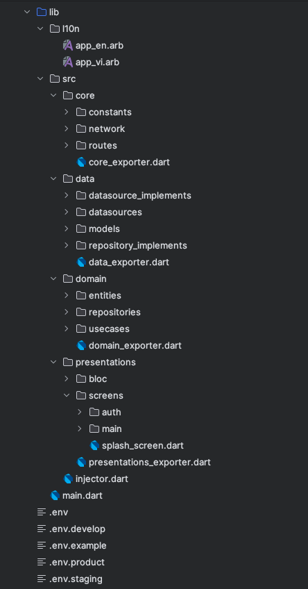

### Project structure

The project structure is based on the clean architecture pattern. The project is divided into three
main layers: data, domain, and presentation.
In addition to these layers, there is a core module that contains the shared code between the layers
like the constants, extensions, utils, etc.

Four layers are wrapped in a package called `lib/src`.

Also, the project contains the localization files in the `lib/l10n` directory.

The project structure is as follows:

#### l10n

- **lib/l10n**: Contains the localization files.
    - **app_en.arb**: Contains the English localization.
    - **app_es.arb**: Contains the Spanish localization.
    - **app_fr.arb**: Contains the French localization.
    - **app_ja.arb**: Contains the Japanese localization.
    - **app_ko.arb**: Contains the Korean localization.
    - **app_vi.arb**: Contains the Vietnamese localization.
    - **app_zh.arb**: Contains the Chinese localization.

#### Core

- **lib/src/core**: Contains the shared code between the layers.
    - **constants**: Contains the constants.
    - **extensions**: Contains the extensions.
    - **utils**: Contains the utils.
    - **app_theme.dart**: Contains the app theme.
    - **routes**: Contains the routes, that are generated by the `auto_route` package.

#### Data [[See more...](project_structure/data.md)]

- **lib/src/data**: Contains the data layer.
    - **datasources**: Contains the datasources.
    - **datasources_implements**: Contains the datasources implementations.
    - **models**: Contains the models.
    - **repositories**: Contains the repositories.
    - **data_exporter.dart**: It exports the data layer.

#### Domain [[See more...](project_structure/domain.md)]

- **lib/src/domain**: Contains the domain layer.
    - **entities**: Contains the entities.
    - **repositories**: Contains the repositories.
    - **usecases**: Contains the use cases.
    - **domain_exporter.dart**: It exports the domain layer.

#### Presentation [[See more...](project_structure/presentation.md)]

- **lib/src/presentation**: Contains the presentation layer.
    - **blocs**: Contains the blocs.
    - **screens**: Contains the screens.
    - **screens/widgets**: Contains the widgets for the screens.
    - **widgets**: Contains the common widgets for all screens.
    - **presentation_exporter.dart**: It exports the presentation layer.

#### Others

- **lib/src/injector.dart**: Contains the dependency injection configuration.
- **lib/main.dart**: Contains the main function.