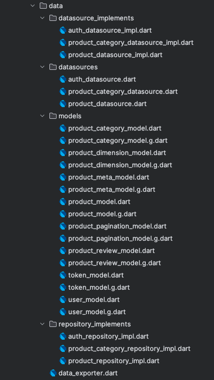

### Data Layer

The data layer is responsible for managing the data of the application. It contains the following
packages:



- **datasources**: Contains the datasources.
- **datasources_implements**: Contains the datasources implementations.
- **models**: Contains the models.
- **repositories**: Contains the repositories.
- **data_exporter.dart**: It exports the data layer.

#### Datasources

The datasources package contains the classes that are responsible for fetching the data from the
network or the local database. It contains the following classes:

```dart
import 'package:kappa/kappa.dart';

abstract class FooDatasource extends BaseDataSource {
  Future<FooModel> getFoo({
    required String foo,
    String? bar,
    int foobar = 30,
  });

  Future<List<FooModel>> getListFoo({
    int perPage = 30,
    int page = 1,
    Map<String, dynamic>? query,
  });
}
```

#### Datasources Implementation

- Remote Datasource

```dart
import 'package:dio/dio.dart';
import 'package:kappa/kappa.dart';

import '../../core/core_exporter.dart';
import '../data_exporter.dart';

class FooDatasourceImpl extends BaseRemoteDataSourceImpl implements FooDatasource {
  FooDatasourceImpl(super._dioClient);

  @override
  Future<TokenModel> getFoo({
    required String foo,
    String? bar,
    int foobar = 30,
  }) async {
    try {
      final response = await dio.post(
        UrlConstants.getFooUrl,
        data: {
          'foo': foo,
          'bar': bar,
          'foobar': foobar,
        },
        options: Options(
          headers: {'Content-Type': 'application/json'},
        ),
      );

      final model = FooModel.fromJson(response.data as Map<String, dynamic>);

      return model;
    } catch (_) {
      rethrow;
    }
  }

  @override
  Future<List<FooModel>> getListFoo({
    int perPage = 30,
    int page = 1,
    Map<String, dynamic>? query,
  }) async {
    try {
      final response = await dio.post(
        UrlConstants.getListFooUrl,
        data: {
          'perPage': perPage,
          'page': page,
          'query': query,
        },
        options: Options(
          headers: {'Content-Type': 'application/json'},
        ),
      );

      final model = TokenModel.fromJson(response.data as Map<String, dynamic>);
      final model = response.data
          .map<FooModel>((e) => FooModel.fromJson(e as Map<String, dynamic>))
          .toList();

      return model;
    } catch (_) {
      rethrow;
    }
  }
}
```

- Local Datasource

```dart
import 'package:dio/dio.dart';
import 'package:kappa/kappa.dart';

import '../../core/core_exporter.dart';
import '../data_exporter.dart';

class FooDatasourceImpl extends BaseLocalDataSourceImpl implements FooDatasource {
  FooDatasourceImpl(super._localDatabase);

  @override
  Future<TokenModel> getFoo({
    required String foo,
    String? bar,
    int foobar = 30,
  }) async {
    try {
      final model = await localDatabase.db.fooCollections
          .where()
          .fooEqualTo(foo)
          .foobarGreaterThan(foobar)
          .findFirst();

      return model;
    } catch (_) {
      rethrow;
    }
  }

  @override
  Future<List<FooModel>> getListFoo({
    int perPage = 30,
    int page = 1,
    Map<String, dynamic>? query,
  }) async {
    try {
      final list = await localDatabase.db.fooCollections
          .filter()
          .where()
          .offset((page - 1) * perPage)
          .limit(perPage)
          .findAll();

      return list;
    } catch (_) {
      rethrow;
    }
  }
}
```

#### Models

```dart
import 'package:json_annotation/json_annotation.dart';
import 'package:kappa/kappa.dart';

import '../../domain/domain_exporter.dart';

part 'foo_model.g.dart';

@JsonSerializable()
class FooModel extends BaseModel<FooModel, FooEntity> {
  final String? foo;
  final String? bar;
  final int? foobar;

  FooModel({
    this.foo,
    this.bar,
    this.foobar,
  });

  factory FooModel.fromJson(Map<String, dynamic> json) =>
      _$FooModelFromJson(json);

  Map<String, dynamic> toJson() => _$FooModelToJson(this);

  @override
  List<Object?> get props =>
      [
        foo,
        bar,
        foobar,
      ];

  @override
  FooEntity toEntity() =>
      FooEntity(
        foo: foo,
        bar: bar,
        foobar: foobar,
      );

  @override
  BaseModel<FooModel, BaseEntity> empty() =>
      const FooModel(
        foo: '-',
        bar: '-',
        foobar: 0,
      );
}
```

#### Repository Implementation

```dart
import 'package:dartz/dartz.dart';
import 'package:dio/dio.dart';
import 'package:kappa/kappa.dart';

import '../../domain/domain_exporter.dart';
import '../data_exporter.dart';

class FooRepositoryImpl extends BaseRepositoryImpl implements FooRepository {
  final FooRemoteDatasource _fooRemoteDatasource;
  final FooLocalDatasource _fooLocalDatasource;

  FooRepositoryImpl(this._fooRemoteDatasource, this._fooLocalDatasource);

  @override
  Future<Either<NetworkException, Single<FooEntity>>> getFoo({
    required String foo,
    String? bar,
    int foobar = 30,
  }) async {
    try {
      final result = await _fooRemoteDatasource.getFoo(
        foo: foo,
        bar: bar,
        foobar: foobar,
      );

      return Right(Single(result.toEntity()));
    } on DioException catch (e) {
      return Left(NetworkException.fromDioError(e));
    }
  }

  @override
  Future<Either<DatabaseException, ListOf<FooEntity>>> getListFoo({
    int perPage = 30,
    int page = 1,
    Map<String, dynamic>? query,
  }) async {
    try {
      final result = await _fooLocalDatasource.getListFoo(
        perPage: perPage,
        page: page,
        query: query,
      );

      return Right(ListOf(result.map((e) => e.toEntity()).toList()));
    } on IsarError catch (e) {
      return Left(DatabaseException.fromIsarError(e));
    }
  }
}

```