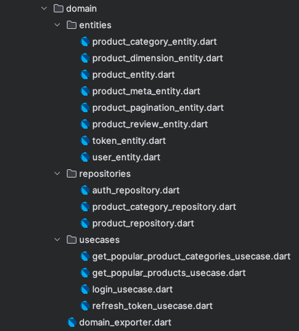

### Domain Layer

The domain layer is responsible for managing the business logic of the application. It contains the
following packages:



#### Entities

```dart
import 'package:kappa/kappa.dart';

class FooEntity extends BaseEntity {
  final String? foo;
  final String? bar;
  final int? foobar;

  const FooEntity({
    this.foo,
    this.bar,
    this.foobar,
  });

  static FooEntity empty() =>
      const FooEntity(
        foo: '-',
        bar: '-',
        foobar: 0,
      );

  @override
  List<Object?> get props =>
      [
        foo,
        bar,
        foobar,
      ];

  Map<String, dynamic> toMap() =>
      {
        'foo': foo,
        'bar': bar,
        'foobar': foobar,
      };

  factory FooEntity.fromMap(Map<String, dynamic> map) =>
      FooEntity(
        foo: map['foo'],
        bar: map['bar'],
        foobar: map['foobar'],
      );

  @override
  String toString() => 'FooEntity(foo: $foo, bar: $bar, foobar: $foobar)';
}
```

#### Repositories

```dart
import 'package:dartz/dartz.dart';
import 'package:kappa/kappa.dart';

import '../domain_exporter.dart';

abstract class FooRepository extends BaseRepository {
  Future<Either<NetworkException, Single<FooEntity>>> getFoo({
    required String foo,
    String? bar,
    int foobar = 30,
  });

  Future<Either<DatabaseException, ListOf<FooEntity>>> getListFoo({
    int perPage = 30,
    int page = 1,
    Map<String, dynamic>? query,
  });
}
```

#### Use Cases

```dart
import 'package:dartz/dartz.dart';
import 'package:kappa/kappa.dart';

import '../domain_exporter.dart';

class FooUsecaseParams extends UseCaseParams {
  final int perPage;
  final int page;
  final Map<String, dynamic>? query;

  const FooUsecaseParams({
    this.perPage = 30,
    this.page = 1,
    this.query,
  });

  @override
  FooUsecaseParams fromJson(Map<String, dynamic> json) =>
      FooUsecaseParams(
        perPage: json['perPage'],
        page: json['page'],
        query: json['query'],
      );

  @override
  Map<String, dynamic> toJson() =>
      {
        'perPage': perPage,
        'page': page,
        'query': query,
      };
}

class GetPopularFooUsecase extends BaseUseCase<NetworkException, FooEntity, FooUsecaseParams> {
  final FooRepository _fooRepository;

  GetPopularProductCategoriesUsecase(this._fooRepository);

  @override
  Future<Either<DatabaseException, ListOf<FooEntity>>> execute(FooUsecaseParams params) async {
    return await _fooRepository.getListFoo(
      perPage: params.perPage,
      page: params.page,
      query: params.query,
    );
  }
}
```